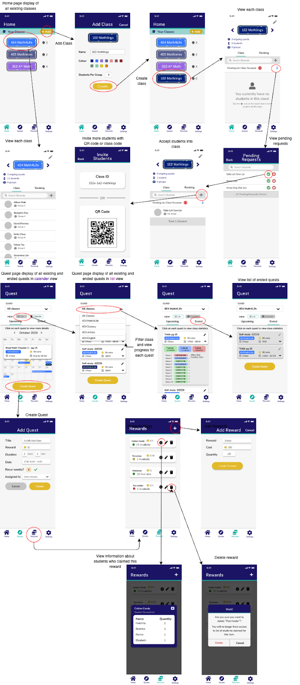

---
layout: single
classes: wide
title: "Using QuestCrunch"
permalink: /docs/
sidebar:
    nav: "sidebar-nav"
toc: true
toc_label: "Table of Contents"
--- 

This page covers the features implemented in our prototype, and the intended use of the application.

## Recommended Use

## Features
This section covers an overview of the features available in our prototype. 

### Teacher Interface 

### Student Interface

## User Flow of Application
The following diagrams illustrate the overall user flow of QuestCrunch

### Teacher User Flow

### Student User Flow

## Possible Extensions
This section covers possible extensions for our project. 