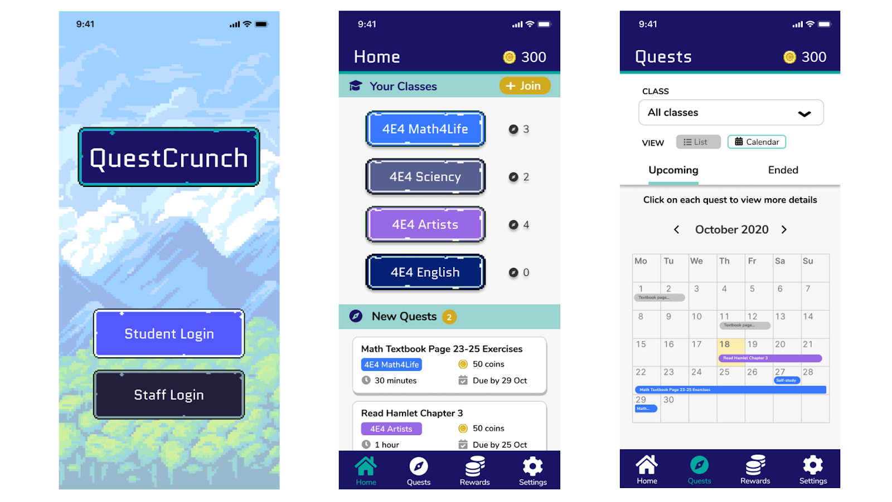
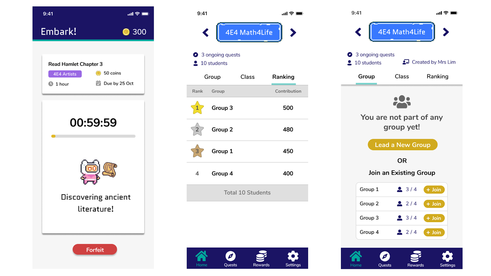

## Overview

**Background**  
For our project, we conducted 2 rounds of usability testing 

1. Expert (peer) Evaluation
2. User Evaluation

As QuestCrunch has 2 target user groups, our prototypes have 2 user interfaces, an interface for teachers, and an interface for students. The fact that we have 2 user interfaces was taken into consideration during our evaluation of the prototype, as we wanted to ensure the needs of each user group are met in their specific interfaces in our prototypes.

### Evaluation Process



**Disclaimer**

As we did not retrieve any identifying information from the participants throughout the evaluation, we did not feel the need to draft any conset forms as all participants' personal data is protected.



#### Expert (Peer) Evaluation
The Expert (Peer) Evaluation was done by all 4 members of our team, and consisted of 4 peer evaluators evaluating both views for 2 different prototypes from our [Second Iteration Prototypes](/questcrunch/our-process/#prototype-2nd-iteration) This was conducted in Week 10. The findings gathered from this evaluation were used in the development of our [Third Iteration Prototype](/questcrunch/our-process/#prototype-3rd-iteration)

#### User Evaluation
The User Evaluation was conducted with our real target users, teachers and students. 3 students and 2 teachers evaluated their respective interfaces on our [Third Iteration Prototype](/questcrunch/our-process/#prototype-3rd-iteration). This was conducted in Week 11. The findings gathered from this evaluation were used in the development of our [Fourth Iteration Prototype](/questcrunch/our-process/#prototype-4th-iteration) aka our final prototype.

{{ disclaimer | markdownify }}

## Expert (Peer) Evaluation

For this evaluation, we consulted 4 of our peers in the same module for their insighs and feedback on the user flow and interface design of our application. The evaluation was conducted by all members of the team, over Zoom. 

A detailed breakdown of our evaluation plan can be found at the following link 

[View Evaluation Plan](https://docs.google.com/document/d/1mDH7T2XLrzwWuDr8nBcftSAlmypC7ERmCkwM-8MGmdE/edit?usp=sharing){: .btn .btn--info}

### Purpose

Our main goal for this stage of evaluation, was to get an insight on the general _usability_ of each of the 2 prototypes, and the intuitivity of the user flows to complete tasks in the application-- From the perspective of peers that are well versed with the design concepts and heuristics taught in the module.





### Plan

Firstly, we presented 2 prototypes to the experts. As each prototype has 2 user flows - one for teacher and one for student - we came up with the following combination of testing using the **Latin Square Counterbalancing Method**

| Evaluator | Prototype Sequence | View Sequence |
|-----------|--------------------|---------------|
|1| A &#9658; B| Teacher &#9658; Student|
|2| A &#9658; B| Student &#9658; Teacher |
|3| B &#9658; A| Teacher &#9658; Student |
|4| B &#9658; A| Student &#9658; Teacher |


_**Example**_  
Evaluator 1 will evaluate Prototype A's Teacher view first, followed by Prototype B's Teacher view, followed by Prototype A's Student view, followed by Prototype B's student view


{{ lattice-example | markdownify}}

We gave each evaluator a list of tasks, and each evaluator was instructed to complete each task in succession. Each evaluator's performance on each task was rated using the following scale:

|Percentage|Description|
|----------|-----------|
|0%|Failed to complete the task correctly, gives up, or succeeds only with an assistance from moderator|
|50%|Succeeds, but in a roundabout way, making errors, needing to back track or using on-line help|
|100%|Succeeds quickly, following the intended user flow|

### Results

After the evaluation, we summarised the issues raised during each evaluation session for each prototype. A detailed report on the results and responses received from each evaluator can be found at the following link 

[View Peer Evaluation Results](https://docs.google.com/document/d/1ZUKYrPgtIlRw27-JSuJBi515Fk1e4NPJaNzw9SYYjII/edit?usp=sharing){: .btn .btn--info}

**Prototype A**  

|No.| Page/Component| Issue | Severity |
|---|---------------|-------|----------|
|1| Navbar | &#8226; Group icon was not intuitive as it led to a page that started quests.   &#8226; Path to Quest Page was not user-friendly | High |
|2| Groups Page | Felt lacking in functionality and was too simple | Medium |
|3| Overall | Lack of back/cancel buttons can make it hard for the user to feel in control | Medium |
|4| Overall | Application does not prompt the user for confirmation/show a success message after the user completes some activity, may make the user feel not in control. | Medium |
|5| Home Page | Class details may provide too much information for user to parse through in a dropdown | Medium |
|6| Overall | Colour scheme may be too monotonic | Low |
|7| Home Page | Calendar icon to switch to calendar view was not intuitive | Low |

 

**Prototype B**

|No.| Page/Component| Issue | Severity |
|---|---------------|-------|----------|
|1| Class Details Page, Quest Page | Too many details in one page can increase cognitive load placed on user | High |
|2| Navbar | Symbols used were not intuitive (e.g. Pencil for study tab, Calendar for quests tab) | High |
|3| Class Details | Path to complete tasks (e.g. Add students to class) in Class Details page is not intuitive | High |
|4| Quest Page | Difference between Calendar View and List View was not clear | Medium |
|5| Home Page | Home page did not provide enough information for the user to understand the current state of the application | Medium |
|6| Overall | Lack of back/cancel buttons can make it hard for the user to feel in control | Medium |
|7| Overall | Application does not prompt the user for confirmation/show a success message after the user completes some activity, may make the user feel not in control.| Medium |
|8| Overall | Distracting background and colour scheme can make it difficult for users to navigate through the application | Low |

 

**Prototype A vs. Prototype B**

From the evaluation, we summarised the aspects that we felt one prototype performed better in during the evaluation. 

|Aspects| Prototype A| Prototype B|
|-------|------------|------------|
| User Flow |&#10004; | |
| Functionality | |&#10004; |
| Appeal to Teachers | &#10004;| |
| Appeal to Students | | &#10004;| 

### Insights  

Overall, our findings were that Prototype A had a clear user flow, but was too plain looking and felt lacking in functionality due to its simplistic take. On the other hand, prototype B was visually pleasing but at times it seemed visually overwhelming and overly complicated, making users confused on certain user navigation with a significantly lower percentage of completion. Yet, the majority of the users still preferred prototype B for its completeness.

As such, we aimed to strike a balance between functional, completeness, visual simplicity and appeal for our final prototype, while addressing the above problems raised, so that our application will be both easy to navigate and appealing to our target audiences.

## User Evaluation

For this evaluation, we managed to contact 3 students and 2 teachers to conduct a real user evaluation on the [3rd iteration of our prototype](/questcrunch/our-process/#prototype-3rd-iteration). The evaluation was conducted by all members of the team, via Zoom.

### Purpose

The purpose of this evaluation is to get an understanding of the usability and intuitiveness of our application from the perspective of our target users. The results of this round of evaluation are crucial to understand important flaws in the current prototype that we may have missed out during the design process.

### Plan

The user evaluation was conducted in a similar fashion as the peer evaluation. 3 secondary students were asked to complete a list of tasks on the student version of the application and 2 teachers were asked to complete a list of tasks on the teacher version. The users’ performance were then rated using the same scale as the one used in the peer evaluation. 

After completing each task, we enquired about their process and found out more about their thought process.
At the end of the evaluation, we asked them general comments about the colour scheme, overall applicability, and appeal of our application. 

### Results

A detailed report on the results and responses received from each evaluator can be found at the following link 

[View User Evaluation Results](https://docs.google.com/document/d/1GO8cm5W0EPDc9ytAh63yDP0qb6BTgirxnGwJOV7l2ac/edit?usp=sharing){:.btn .btn--info}

After this round of evaluation, we once again summarised the issues raised by the user evaluators during our testing. 

|No.| Page/Component | Usability Problem | Severity |
|---|----------------|-------------------|----------|
| 1| Class Page (Teacher) | Difficult to find the button to add a new student to the class, as the ‘plus’ button was not very intuitive. A user mentioned that they had to read the text on the search bar beside it to understand its use. | High |
| 2| Home Page | The class labels were complex in design, which made most of the users a little confused when they first arrived on the home page. Some users mentioned that the page felt rather noisy. | Medium |
| 3| Quests Page | The buttons to toggle between list and calendar were small, which made it difficult to click on | Medium |
| 4| Join Class Page | The buttons to join a class via class id and to join a class via qr code were too close to each other and caused some confusion on how to proceed | Medium |
| 5 | Overall | Some inconsistency in button sizes in certain pages made it harder for users to identify the main action of the page | Low |

### Insights

The general takeaway from this round of evaluation was that our prototype was easy to navigate through, and the colour scheme was appealing to the audience, however we still had some things to resolve as seen by the issues raised in the results. These insights were used to further refine and standardise the look and feel of our prototype to improve usability for our target users. Thus resulted in our final prototype aka our [Fourth Iteration Prototype](/questcrunch/our-process/#prototype-4th-iteration).