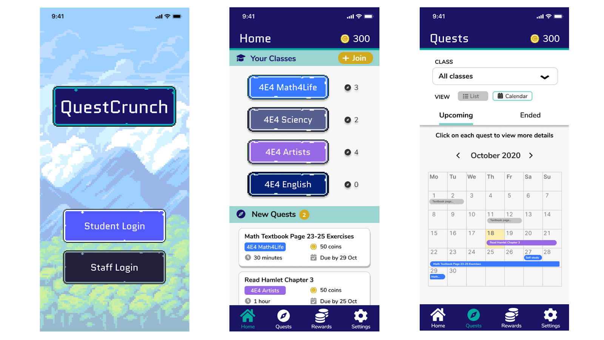
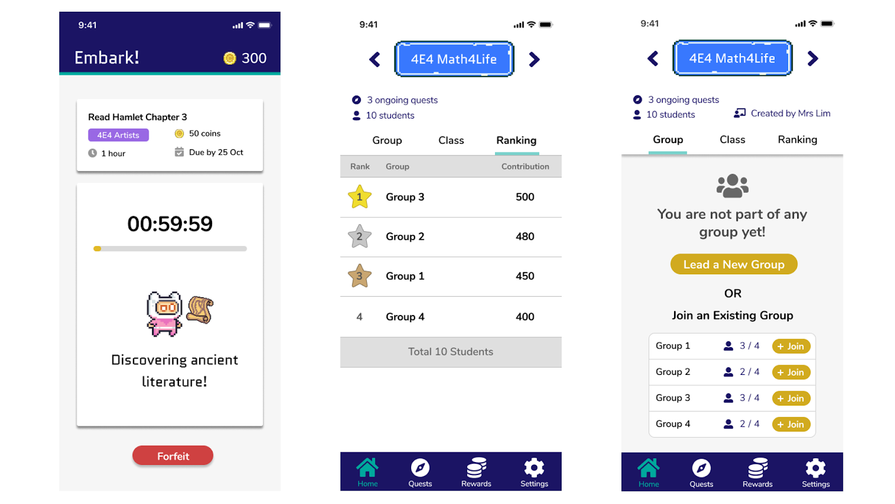

## User Study Plan

[View User Study Plan](../downloads/user-study-plan.pdf){: .btn .btn--info}

## Design Process

**Ideation Stage**  
The team came together to brainstorm different possible user interfaces using the Crazy 8's method exercise practiced in lecture

### Prototype 1st Iteration
For this 1st iteration, each member came up with 1 prototype each based on our own design ideas, and the list of functions we had came up with for QuestCrunch.




**Links to Prototypes**  
- [Beatrice's Prototype](https://www.figma.com/file/1ToIF30VJqs9NkOJ5psGkh/CS3240-QuestCrunch-Beats-Prototype?node-id=0%3A1)  
- [Harshita's Prototype](https://www.figma.com/file/PQWmo02hn3ZehW9WVRuF23/QuestCrunch-Prototype---Harshita?node-id=0%3A1)  
- [Elizabeth's Prototype](https://www.figma.com/file/UA5p3GrWht12BUhlObDx4X/Elizabeth-Prototype?node-id=1%3A137)  
- [Ranice's Prototype](https://www.figma.com/file/Thxmllsblou1vUSflYXVrk/CS3240-Project-Prototype?node-id=0%3A1)


{{ links-to-prototypes | markdownify }}

### Prototype 2nd Iteration
For the 2nd iteration, we decided to pick the 2 best prototypes from the 4 prototypes in the 1st iteration

**Prototype A (Elizabeth's Prototype)**  
Prototype A by Elizabeth is a minimalist take on the application, with a soothing colour palette and simplified icons. We felt that its simple UI could be appealing to teachers, which is one of our major target audiences.



**Prototype B (Beatrice's Prototype)**  
Prototype B by Beatrice is a gamified take on the application, with a bold colour palette and pixel art that grabs attention. We felt that this eye-catching UI could be appealing to students, which is our other major target audience.



Using these 2 prototypes, we conducted our expert evaluation on our peers to guage the usability, pros and cons of each respective prototype.

### Prototype 3rd Iteration
For the 3rd iteration, after gathering feedback from our expert evaluation, we decided to combine the good aspects of each respective prototype into 1 semi-final prototype.

In coming up with this 3rd iteration of the prototype, we carefully considered _Neilson's Heuristics_ in the design of each page. 

| Heuristic          | Feature in Prototype |
|--------------------|----------------------|
|1. Visibility of system status |  a. When user does an action, they will receive a notification pop up to indicate completeness of the action taken   b. Teachers are informed of the the number of available rewards in the rewards tab |
|2. Match between system and the real world | a. Icons that were used mirrors similar events in the real world: eg: to represent the calendar view, we had a calendar icon. A House icon to represent the home page. These icons are very much understandable and user were able to navigate through the prototype well.   b. Teachers are informed of the availability status of rewards through the 3-colour traffic colour theme (green, yellow, red) to represent available, runnings low or unavailable respectively |
|3. User control and freedom | Users are allowed to go back when they are on secondary pages (not the landing page for respective menu tab icons) |
|4. Consistency and standards | Buttons, fonts and font size were standardized throughout the final prototype |
|5. Error Prevention | We included respective warning messages for ‘dangerous’ acts such as deleting rewards and forfeiting quests |
|6. Recognition over recall | |
|7. Flexibility and Efficiency of Use ||
|8. Aesthetic and minimalistic Design||
|9. Help users recognise, diagnose, and recover from errors ||
|10. Help and Documentation||

Using this 3rd prototype, we conducted another evaluation with our target users, Teachers and Students. 

### Prototype 4th Iteration