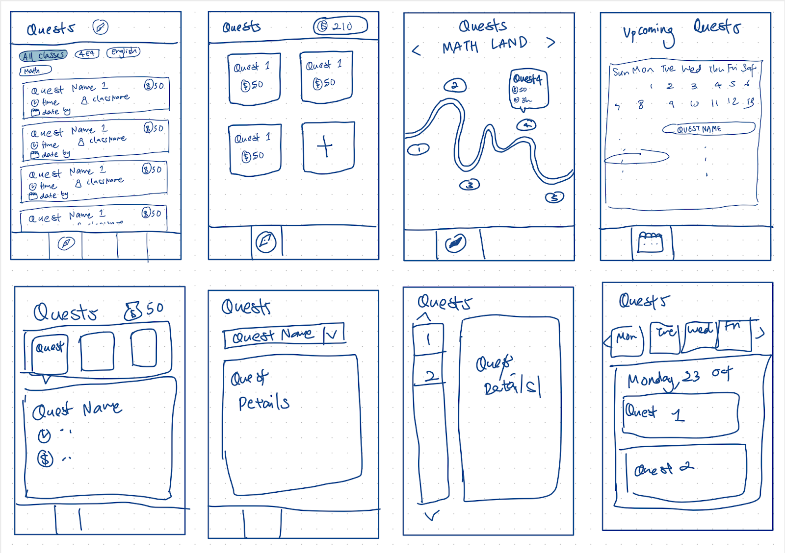
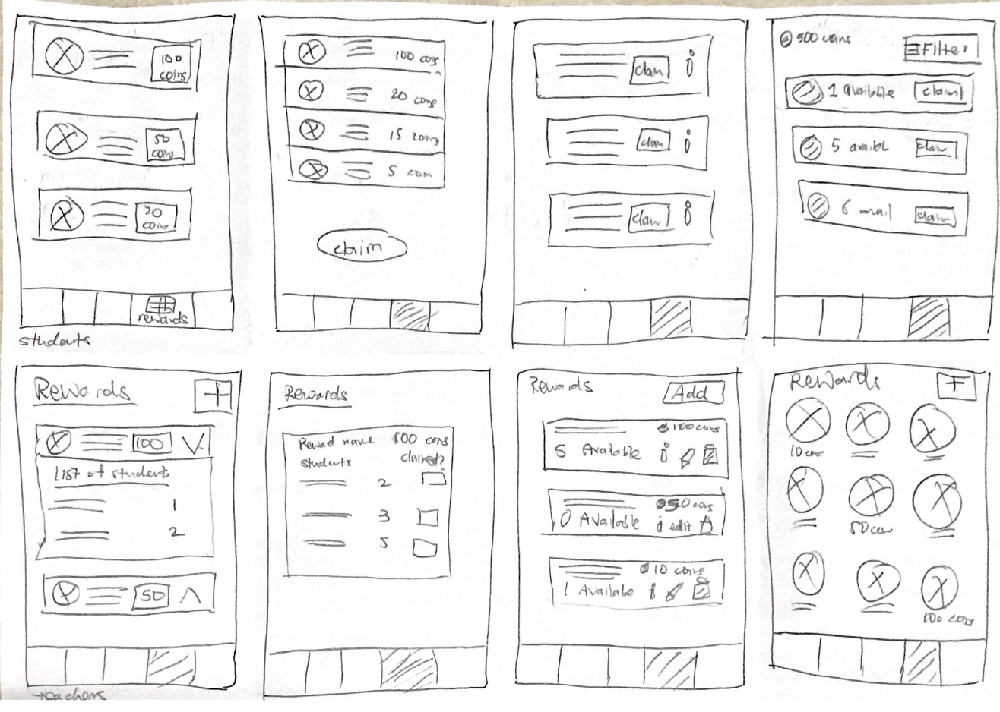

## Project Proposal

**The Initial Idea**

Our initial project idea, was called PomoFomo. Our idea for PopoFomo was to create an application that encourages students to study, using peer motivation and competition between peers. 

The main idea for the application is to create a platform where students have access to a shared virtual room with their friends and they can work together to complete self-scheduled timed study sessions, and earn coins upon completion of a study session. The coins earned then can be used to decorate the shared virtual room with their friends.

**Issues**

However, we realised that this solution is already widely available and several existing platforms such as Forest and Pomodoro already address this issue of lack of focus and motivation among students. Hence, we decided to specialize our target audience and re-focus the solution to the problem we aimed to solve. 

**QuestCrunch**

We decided to create an application that enables teachers to ensure productivity of their students, for events such as timed quizzes, assignments or mock papers. As there is no existing solution for this niche market, the lack of home-based learning solutions for teachers was something we felt was pertinent to address, especially now with the Covid-19 situation where students are expected to stay motivated and disciplined at home. Thus, QuestCrunch was born. 

## User Study Plan

As our application aims to provide a solution that involves both teachers and students, we have 2 target users, namely teachers and students. Our User Study Plan consists of online surveys, as well as online scripted interviews with real teachers and students within the Secondary and Junior College level. 

Our complete User Study Plan can be viewed at the link below in `pdf` form

[View User Study Plan](../downloads/user-study-plan.pdf){: .btn .btn--info}

Upon completion of the User Study Plan, our team was able to gain more insights on the issues students may face from both the student's personal perspective, as well as from the perspective of experienced teachers who may have more understanding on the behaviours and worries of their students, and the struggles a student may face when studying.

Using the insights gained, we were able to have an idea of the kind of functions and features that will be useful in addressing the pain points highlighted in our user study. Thus began our design process.

## Design Process

### Ideation Stage  

The team came together to brainstorm different possible user interfaces using the Crazy 8's method exercise practiced in lecture



### Prototype 1st Iteration
For this 1st iteration, each member came up with 1 prototype each based on our own design ideas, and the list of functions we had came up with for QuestCrunch.





**Links to Prototypes**  
- [Prototype 1](https://www.figma.com/file/Thxmllsblou1vUSflYXVrk/CS3240-Project-Prototype?node-id=0%3A1)
- [Prototype 2](https://www.figma.com/file/UA5p3GrWht12BUhlObDx4X/Elizabeth-Prototype?node-id=1%3A137) 
- [Prototype 3](https://www.figma.com/file/PQWmo02hn3ZehW9WVRuF23/QuestCrunch-Prototype---Harshita?node-id=0%3A1)  
- [Prototype 4](https://www.figma.com/file/1ToIF30VJqs9NkOJ5psGkh/CS3240-QuestCrunch-Beats-Prototype?node-id=0%3A1)  



{{ links-to-prototypes | markdownify }}

### Prototype 2nd Iteration
For the 2nd iteration, we decided to pick the 2 best prototypes from the 4 prototypes in the 1st iteration, to be used for our [Expert (Peer) Evaluation]().

**Prototype A**  
Prototype A is a minimalist take on the application, with a soothing colour palette and simplified icons. We felt that its simple UI could be appealing to teachers, which is one of our major target user groups.



**Prototype B**  
Prototype B is a gamified take on the application, with a bold colour palette and pixel art that grabs attention. We felt that this eye-catching UI could be appealing to students, which is our other major target user group.



Using these 2 prototypes, we conducted our [Expert (Peer) Evaluation]() to guage the usability, pros and cons of each respective prototype. We aimed to use the results, opinions and feedback gathered from the evaluation to further refine and create a final prototype from the 2 prototypes. 

### Prototype 3rd Iteration
For the 3rd iteration, after gathering feedback from our expert evaluation, we decided to combine the good aspects of each respective prototype into 1 semi-final prototype.

In coming up with this 3rd iteration of the prototype, we carefully considered _Neilson's Heuristics_ in the design of each page. 

| Heuristic          | Feature in Prototype |
|--------------------|----------------------|
|1. Visibility of system status |  a. When user does an action, they will receive a notification pop up to indicate completeness of the action taken   b. Teachers are informed of the the number of available rewards in the rewards tab |
|2. Match between system and the real world | a. Icons that were used mirrors similar events in the real world: eg: to represent the calendar view, we had a calendar icon. A House icon to represent the home page. These icons are very much understandable and user were able to navigate through the prototype well.   b. Teachers are informed of the availability status of rewards through the 3-colour traffic colour theme (green, yellow, red) to represent available, runnings low or unavailable respectively |
|3. User control and freedom | Users are allowed to go back when they are on secondary pages (not the landing page for respective menu tab icons) |
|4. Consistency and standards | Buttons, fonts and font size were standardized throughout the final prototype |
|5. Error Prevention | We included respective warning messages for ‘dangerous’ acts such as deleting rewards and forfeiting quests |
|6. Recognition over recall | |
|7. Flexibility and Efficiency of Use ||
|8. Aesthetic and minimalistic Design||
|9. Help users recognise, diagnose, and recover from errors ||
|10. Help and Documentation||

Using this 3rd prototype, we conducted another evaluation with our target users, Teachers and Students. 

### Prototype 4th Iteration